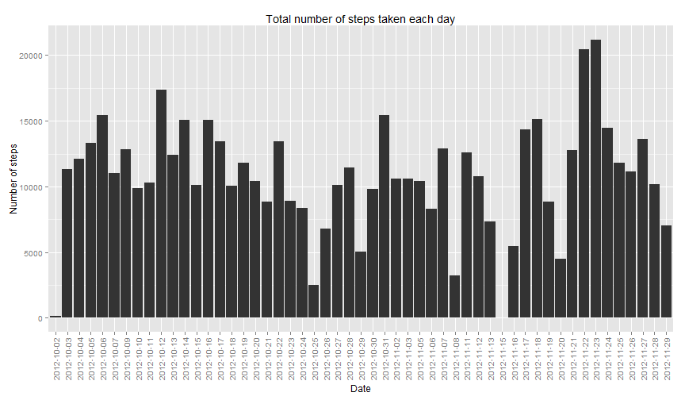
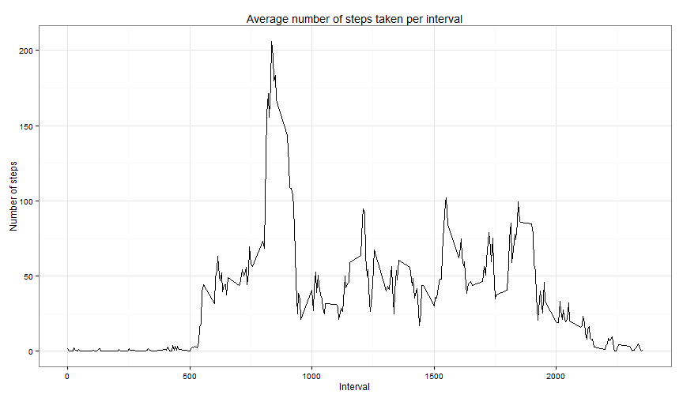
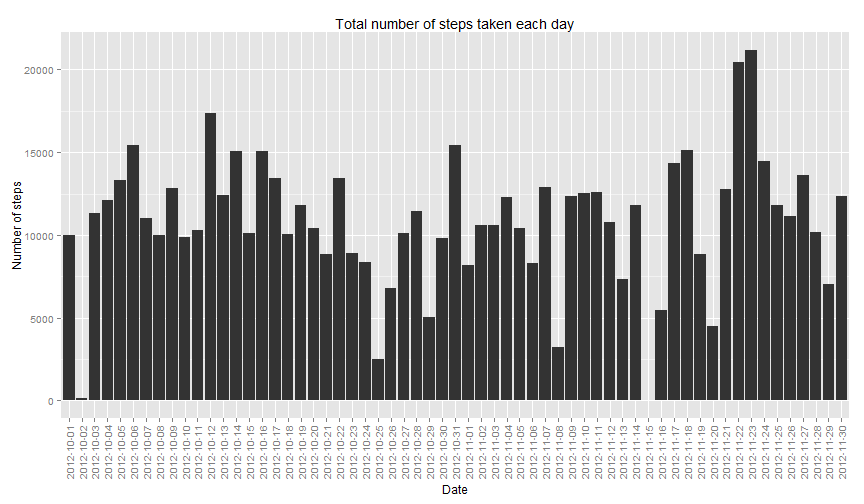
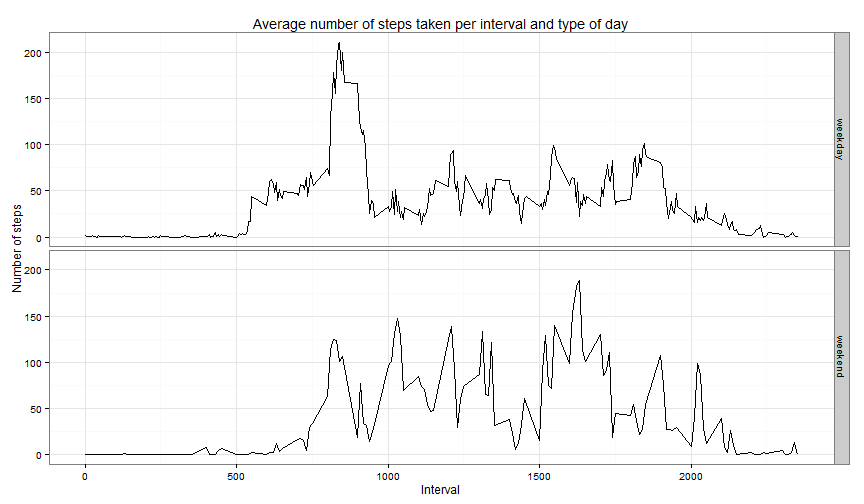

## Loading and preprocessing the data


```r
#loading data.table package
library(data.table)

#loading the data
activity <- data.table(
                read.csv(
                        file="activity/activity.csv"
                        , colClasses=c("numeric", "character", "numeric")
                        , na.strings="NA"                        
                )
        )
#converting date column to Date class
activity[, date := as.Date(date)]
```

```
##        steps       date interval
##     1:    NA 2012-10-01        0
##     2:    NA 2012-10-01        5
##     3:    NA 2012-10-01       10
##     4:    NA 2012-10-01       15
##     5:    NA 2012-10-01       20
##    ---                          
## 17564:    NA 2012-11-30     2335
## 17565:    NA 2012-11-30     2340
## 17566:    NA 2012-11-30     2345
## 17567:    NA 2012-11-30     2350
## 17568:    NA 2012-11-30     2355
```

```r
summary(activity)
```

```
##      steps             date               interval     
##  Min.   :  0.00   Min.   :2012-10-01   Min.   :   0.0  
##  1st Qu.:  0.00   1st Qu.:2012-10-16   1st Qu.: 588.8  
##  Median :  0.00   Median :2012-10-31   Median :1177.5  
##  Mean   : 37.38   Mean   :2012-10-31   Mean   :1177.5  
##  3rd Qu.: 12.00   3rd Qu.:2012-11-15   3rd Qu.:1766.2  
##  Max.   :806.00   Max.   :2012-11-30   Max.   :2355.0  
##  NA's   :2304
```

## What is mean total number of steps taken per day?

```r
library(ggplot2)

#generating a histogram of total number of steps taken each day
g <- ggplot(activity[!is.na(steps)], aes(x=factor(date), y=steps)) +
        geom_bar(stat="identity") +
        ggtitle("Total number of steps taken each day") +
        labs(x="Date", y = "Number of steps") +
        theme(axis.text.x = element_text(angle=90,vjust=0.5,hjust=1)) 
print(g)  
```

 

```r
#creating table containing sum of steps per day
sum.of.steps.by.date <- activity[
                ,list(sum.of.steps = sum(steps))
                ,by=date
        ]

#making variables to use in the text below
steps.mean <- mean(sum.of.steps.by.date$sum.of.steps, na.rm=TRUE)
steps.median <- median(sum.of.steps.by.date$sum.of.steps, na.rm=TRUE)
```
1.0766189 &times; 10<sup>4</sup> is the mean total number of steps taken per day.

1.0765 &times; 10<sup>4</sup> is the median total number of step taken per day.


## What is the average daily activity pattern?

```r
#creating table containing average number of steps per interval
avg.steps.by.interval <- activity[
                ,list(avg.steps = mean(steps, na.rm=TRUE))
                ,by=interval
        ]

#generating a time series plot of average number of steps taken per interval
g <- ggplot(avg.steps.by.interval, aes(interval, avg.steps)) +
        geom_line() +
        ggtitle("Average number of steps taken per interval") +
        labs(x="Interval", y = "Number of steps") +
        theme_bw() 
print(g)
```

 

```r
#calculating the interval with the maximum average number of steps
max.avg.steps <- avg.steps.by.interval[,max:=max(avg.steps)][avg.steps==max]
```
The average number of steps across all days occures in the 835 interval and amounts to 206.1698113 average number of steps.

## Imputing missing values

```r
#calculating number of missing values
sum.of.na.rows <- sum(activity[,is.na(steps)])
```
Number of rows with missing value of steps amounts to 2304.


```r
#
#In this chunk I would prefer to write echo=FALSE but it was forbiden to do this :)
#

#setting english setlocale
local.time <- Sys.getlocale("LC_TIME")
Sys.setlocale("LC_TIME", "C")
```

```
## [1] "C"
```

```r
#filling missing values with the average number of steps per interval per weekday
filled.activity <- activity
filled.activity[
                ,week.day := weekdays(date)
        ][
                ,`:=` (avg.steps = mean(steps, na.rm=TRUE))
                ,by=c("interval", "week.day")
        ]
```

```
##        steps       date interval week.day avg.steps
##     1:    NA 2012-10-01        0   Monday  1.428571
##     2:    NA 2012-10-01        5   Monday  0.000000
##     3:    NA 2012-10-01       10   Monday  0.000000
##     4:    NA 2012-10-01       15   Monday  0.000000
##     5:    NA 2012-10-01       20   Monday  0.000000
##    ---                                             
## 17564:    NA 2012-11-30     2335   Friday  0.000000
## 17565:    NA 2012-11-30     2340   Friday  0.000000
## 17566:    NA 2012-11-30     2345   Friday  0.000000
## 17567:    NA 2012-11-30     2350   Friday  0.000000
## 17568:    NA 2012-11-30     2355   Friday  1.142857
```

```r
filled.activity[
        !is.na(steps)
        ,`:=`(filled.steps=steps)
]
```

```
##        steps       date interval week.day avg.steps filled.steps
##     1:    NA 2012-10-01        0   Monday  1.428571           NA
##     2:    NA 2012-10-01        5   Monday  0.000000           NA
##     3:    NA 2012-10-01       10   Monday  0.000000           NA
##     4:    NA 2012-10-01       15   Monday  0.000000           NA
##     5:    NA 2012-10-01       20   Monday  0.000000           NA
##    ---                                                          
## 17564:    NA 2012-11-30     2335   Friday  0.000000           NA
## 17565:    NA 2012-11-30     2340   Friday  0.000000           NA
## 17566:    NA 2012-11-30     2345   Friday  0.000000           NA
## 17567:    NA 2012-11-30     2350   Friday  0.000000           NA
## 17568:    NA 2012-11-30     2355   Friday  1.142857           NA
```

```r
filled.activity[
        is.na(steps)
        ,`:=`(filled.steps=avg.steps)
]
```

```
##        steps       date interval week.day avg.steps filled.steps
##     1:    NA 2012-10-01        0   Monday  1.428571     1.428571
##     2:    NA 2012-10-01        5   Monday  0.000000     0.000000
##     3:    NA 2012-10-01       10   Monday  0.000000     0.000000
##     4:    NA 2012-10-01       15   Monday  0.000000     0.000000
##     5:    NA 2012-10-01       20   Monday  0.000000     0.000000
##    ---                                                          
## 17564:    NA 2012-11-30     2335   Friday  0.000000     0.000000
## 17565:    NA 2012-11-30     2340   Friday  0.000000     0.000000
## 17566:    NA 2012-11-30     2345   Friday  0.000000     0.000000
## 17567:    NA 2012-11-30     2350   Friday  0.000000     0.000000
## 17568:    NA 2012-11-30     2355   Friday  1.142857     1.142857
```

```r
#setting previous datime settings
Sys.setlocale("LC_TIME", local.time)
```

```
## [1] "Polish_Poland.1250"
```

```r
#generating a histogram of total number of steps taken each day for the filled data
g <- ggplot(filled.activity, aes(x=factor(date), y=filled.steps)) +
        geom_bar(stat="identity") +
        ggtitle("Total number of steps taken each day") +
        labs(x="Date", y = "Number of steps") +
        theme(axis.text.x = element_text(angle=90,vjust=0.5,hjust=1)) 
print(g)  
```

 

```r
#creating table containing sum of steps per day with the filled data
sum.of.steps.by.date <- filled.activity[
                ,list(sum.of.steps = sum(filled.steps))
                ,by=date
        ]

#making variables to use in the text below
steps.mean <- mean(sum.of.steps.by.date$sum.of.steps)
steps.median <- median(sum.of.steps.by.date$sum.of.steps)
```
1.082121 &times; 10<sup>4</sup> is the mean total number of steps taken per day considering filled data.  
1.1015 &times; 10<sup>4</sup> is the median total number of step taken per day considering filled data.  
As you can observe, both mean and median number of steps in the filled data has growth a little.
## Are there differences in activity patterns between weekdays and weekends?

```r
#creating a variable indicating if it's a weekday or weekend
filled.activity[
        week.day == c("Sunday","Saterday")
        ,`:=`(day.type="weekend")
]
```

```
##        steps       date interval week.day avg.steps filled.steps day.type
##     1:    NA 2012-10-01        0   Monday  1.428571     1.428571       NA
##     2:    NA 2012-10-01        5   Monday  0.000000     0.000000       NA
##     3:    NA 2012-10-01       10   Monday  0.000000     0.000000       NA
##     4:    NA 2012-10-01       15   Monday  0.000000     0.000000       NA
##     5:    NA 2012-10-01       20   Monday  0.000000     0.000000       NA
##    ---                                                                   
## 17564:    NA 2012-11-30     2335   Friday  0.000000     0.000000       NA
## 17565:    NA 2012-11-30     2340   Friday  0.000000     0.000000       NA
## 17566:    NA 2012-11-30     2345   Friday  0.000000     0.000000       NA
## 17567:    NA 2012-11-30     2350   Friday  0.000000     0.000000       NA
## 17568:    NA 2012-11-30     2355   Friday  1.142857     1.142857       NA
```

```r
filled.activity[
        week.day != c("Sunday","Saterday")
        ,`:=`(day.type="weekday")
]
```

```
##        steps       date interval week.day avg.steps filled.steps day.type
##     1:    NA 2012-10-01        0   Monday  1.428571     1.428571  weekday
##     2:    NA 2012-10-01        5   Monday  0.000000     0.000000  weekday
##     3:    NA 2012-10-01       10   Monday  0.000000     0.000000  weekday
##     4:    NA 2012-10-01       15   Monday  0.000000     0.000000  weekday
##     5:    NA 2012-10-01       20   Monday  0.000000     0.000000  weekday
##    ---                                                                   
## 17564:    NA 2012-11-30     2335   Friday  0.000000     0.000000  weekday
## 17565:    NA 2012-11-30     2340   Friday  0.000000     0.000000  weekday
## 17566:    NA 2012-11-30     2345   Friday  0.000000     0.000000  weekday
## 17567:    NA 2012-11-30     2350   Friday  0.000000     0.000000  weekday
## 17568:    NA 2012-11-30     2355   Friday  1.142857     1.142857  weekday
```

```r
filled.activity[,day.type:=factor(day.type)]
```

```
##        steps       date interval week.day avg.steps filled.steps day.type
##     1:    NA 2012-10-01        0   Monday  1.428571     1.428571  weekday
##     2:    NA 2012-10-01        5   Monday  0.000000     0.000000  weekday
##     3:    NA 2012-10-01       10   Monday  0.000000     0.000000  weekday
##     4:    NA 2012-10-01       15   Monday  0.000000     0.000000  weekday
##     5:    NA 2012-10-01       20   Monday  0.000000     0.000000  weekday
##    ---                                                                   
## 17564:    NA 2012-11-30     2335   Friday  0.000000     0.000000  weekday
## 17565:    NA 2012-11-30     2340   Friday  0.000000     0.000000  weekday
## 17566:    NA 2012-11-30     2345   Friday  0.000000     0.000000  weekday
## 17567:    NA 2012-11-30     2350   Friday  0.000000     0.000000  weekday
## 17568:    NA 2012-11-30     2355   Friday  1.142857     1.142857  weekday
```

```r
#creating table containing average number of steps per interval and type of day
avg.steps.by.interval <- filled.activity[
                ,list(avg.steps = mean(filled.steps))
                ,by=c("interval", "day.type")
        ]

#generating a time series plot of average number of steps taken per interval and type of day
g <- ggplot(avg.steps.by.interval, aes(interval, avg.steps)) +
        facet_grid(day.type ~ .) +
        geom_line() +
        ggtitle("Average number of steps taken per interval and type of day") +
        labs(x="Interval", y = "Number of steps") +
        theme_bw() 
print(g)
```

 
